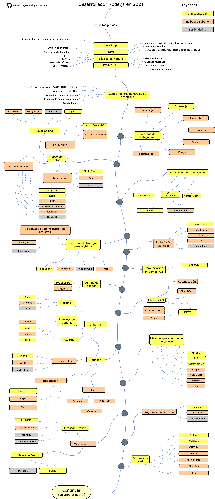

# Hoja de ruta para desarrolladores Node.js

> Hoja de ruta para convertirse en un desarrollador [Node.js](https://nodejs.org/en/) en 2019:

Debajo usted puede encontrar un gráfico que demuestra los diferentes caminos a tomar y las bibliotecas que debería de aprender para convertirse en desarrollador Node.js. Hice este gráfico como un consejo para todos aquellos que me preguntan: "¿Qué debería de aprender como desarrollador Node.js?".

- Idiomas: [:cn: 中文](ReadMe-CN.md) | [:uk: Inglés](/ReadMe.md) | [:pt: Português](/ReadMe-PT.md) | [:es: Español](/ReadMe-ES.md)

## Descargo de responsabilidad

> El próposito de esta hoja de ruta es proveerles una idea sobre el panorama general. Esta le servirá de guía si está en duda sobre qué aprender a continuación, en lugar de elegir aquello que esté de moda. Usted debería de comprender por qué una herramienta sería más adecuada para algunos casos que la otra y recordar que moderno y de moda no siempre significa que sea lo más adecuado para el trabajo.

## ¡Danos una estrella! :star:

Si le gusta o está utilizando este proyecto para aprender o iniciar su solución, por favor brindenos una estrella. ¡Gracias!.

## Hoja de ruta

## Recursos

1. Requisitos previos

   - [JavaScript](https://www.w3schools.com/js/)
   - [NPM](https://docs.npmjs.com/)
   - [Node.js](https://nodejs.org/en/docs/)
   - [ECMAScript](https://www.w3schools.com/js/js_versions.asp)

2. Conocimientos generales de desarrollo

   - Aprender Git, crear algunos repositorios en GitHub, compartir tu código con otras personas
   - Conocer el protocolo HTTP(S), métodos de peticiones (GET, POST, PUT, PATCH, DELETE, OPTIONS)
   - No tener miedo de utilizar Google, [Power Searching with Google](http://www.powersearchingwithgoogle.com/)
   - Leer algunos libros sobre algoritmos y estructuras de datos
   - Código limpio (https://www.w3schools.com/js/js_conventions.asp)

3. Entornos de trabajos Web

   1. [Express.js](https://expressjs.com/)
   2. [Adonis.js](https://adonisjs.com/)
   3. [Meteor.js](https://www.meteor.com/)
   4. [Nest.js](https://nestjs.com/)
   5. [Sails.js](https://sailsjs.com/)
   6. [Koa.js](https://koajs.com/)
   7. [Loopback.io](https://loopback.io/)
   8. [egg.js](https://eggjs.org/en/index.html)
   9. [midway](https://midwayjs.org/midway/en/)

4. Bases de datos

   1. Relacionales
      1. [SQL Server](https://www.microsoft.com/en-us/sql-server/sql-server-2017)
      2. [PostgreSQL](https://www.postgresql.org/)
      3. [MariaDB](https://mariadb.org/)
      4. [MySQL](https://www.mysql.com/)
   2. Base de datos en la nube
      - [CosmosDB](https://docs.microsoft.com/en-us/azure/cosmos-db)
      - [DynamoDB](https://aws.amazon.com/dynamodb/)
   3. Base de datos de búsqueda
      - [ElasticSearch](https://www.elastic.co/)
      - [Solr](http://lucene.apache.org/solr/)
      - [Sphinx](http://sphinxsearch.com/)
   4. Base de datos no relacionales
      - [MongoDB](https://www.mongodb.com/)
      - [Redis](https://redis.io/)
      - [Apache Cassandra](http://cassandra.apache.org/)
      - [LiteDB](https://github.com/mbdavid/LiteDB)
      - [RavenDB](https://github.com/ravendb/ravendb)
      - [CouchDB](http://couchdb.apache.org/)

5. Almacenamiento en caché

   1. [Node-Cache](https://www.npmjs.com/package/node-cache)
   2. Caché distribuida
      1. [Redis](https://redis.io/)
      2. [Memcached](https://memcached.org/)
   3. [Memory Cache](https://www.npmjs.com/package/memory-cache)

6. Registros

   1. Entornos de trabajos para registros
      - [Node-Loggly](https://www.loggly.com/docs/node-js-logs-2/)
      - [Winston](https://github.com/winstonjs/winston)
      - [Node-Bunyan](https://github.com/trentm/node-bunyan)
      - [Morgan](https://github.com/expressjs/morgan)
   2. Sistemas de administración de registros
      - [Sentry.io](http://sentry.io)
      - [Loggly.com](https://loggly.com)

7. Motores de plantillas
   1. [Mustache.js](https://mustache.github.io/)
   2. [Handlebars](https://handlebarsjs.com/)
   3. [EJS](https://ejs.co/)
   4. [Pug](https://pugjs.org/api/getting-started.html)
   5. [Nunjunks.js](https://mozilla.github.io/nunjucks/)

8. Comunicación en tiempo real

   1. [Socket.IO](https://socket.io/)

9. Lenguajes tipados

   1. [TypeScript](https://www.typescriptlang.org/)
   2. [Flow](https://flow.org/)

10. Clientes API

    1. REST
       - [Node-Rest-Client](https://www.npmjs.com/package/node-rest-client)
       - [Axios](https://github.com/axios/axios)
    2. [GraphQL](https://graphql.org/)
    3. [Autenticación]

11. Es bueno saberlo

    - [Async.js](https://caolan.github.io/async/)
    - [PM2](http://pm2.keymetrics.io/)
    - [Commander.js](https://github.com/tj/commander.js/)
    - [Passport](http://www.passportjs.org/)
    - [Nodemailer](https://nodemailer.com/about/)
    - [Marked](https://marked.js.org/#/README.md#README.md)
    - [JSHint](https://github.com/jshint/jshint)

12. Pruebas

    1. Unitarias, funcionales y pruebas de integración
       1. [Jest](https://jestjs.io/)
       2. [Jasmine](https://jasmine.github.io/)
       3. [Chai](https://www.chaijs.com/)
       4. [Mocha](https://mochajs.org/)
       5. [Enzyme](https://github.com/airbnb/enzyme)
       6. [Sinon](https://sinonjs.org/)
    2. Pruebas E2E
       - [Selenium](https://help.crossbrowsertesting.com/selenium-testing/getting-started/javascript/)
       - [Puppeteer](https://github.com/GoogleChrome/puppeteer)

13. Programación de tareas

    - [Agenda](https://github.com/agenda/agenda)
    - [Cronicle](https://github.com/jhuckaby/Cronicle)
    - [Node-Schedule](https://www.npmjs.com/package/node-schedule)

14. Microservicios

    1. Message-Broker
       - [RabbitMQ](https://www.rabbitmq.com/tutorials/tutorial-one-javascript.html)
       - [Apache Kafka](https://www.npmjs.com/package/kafka-node)
       - [ActiveMQ](https://github.com/apache/activemq)
       - [Azure Service Bus](https://docs.microsoft.com/en-us/azure/service-bus-messaging/service-bus-messaging-overview)
    2. Message-Bus
       - [Distribus](https://distribus.com/)
       - [BusMQ](https://github.com/capriza/node-busmq)

15. [Patrones de diseño prácticos en JavaScript](https://www.pluralsight.com/courses/javascript-practical-design-patterns)
16. [Algoritmos y estructuras de datos en JavaScript](https://github.com/trekhleb/javascript-algorithms/)

## Conclusión

Si considera que la hoja de ruta se podría mejorar, por favor cree un PR con las actualizaciones y envíelo. Además, continuaré mejorando esto, por lo que es posible que desee destacar este repositorio para volver a visitarlo en el futuro.

Inspiración: [Hoja de ruta para convertirse en un desarrollador ASP.NET Core](https://github.com/MoienTajik/AspNetCore-Developer-Roadmap)

## Contribuciones

La hoja de ruta ha sido construida usando [Draw.io] (https://www.draw.io/). El archivo del proyecto puede ser encontrado en `Node.js-developer-roadmap.xml`. Para modificarlo, abra draw.io, haga click en ** Abrir diagrama existente ** y elija el archivo `xml` del proyecto. Este le abrirá la hoja de ruta. Actualícelo, suba las imágenes en el archivo ReadMe y cree un PR (exporte como png con un zoom del 400% y comprímalo con [Compressor.io] (https://compressor.io/compress)).

- Abrir un pull request con las mejoras
- Discutir ideas en la sección de problemas
- Correr la voz

## Licencia

